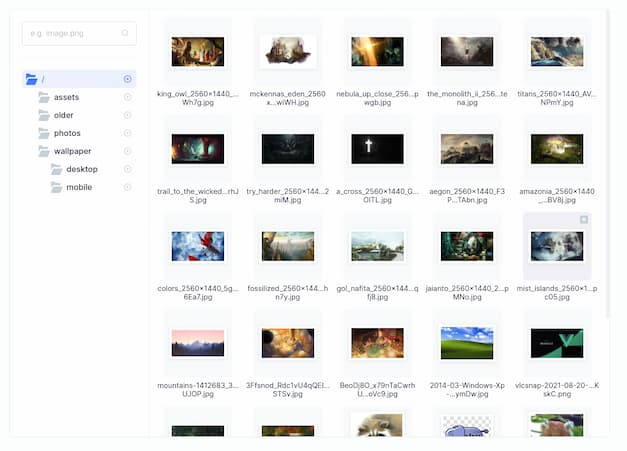

# <file-manager> custom element

[](http://npm.im/filemanager-element)
[](https://github.com/Grafikart/FileManagerJS/actions)



You want a simple file browser for your website, without the hassle of a front-end framework ? Here is a simple custom element for you.

First register the custom element

```js
import {FileManager} from 'filemanager-element'

FileManager.register();
```

Then you can simply use your custom element whenever you want

```html
<file-manager endpoint="http://your.api.com/endpoint"></file-manager>
```

You just have to implement the API following this [Open API specification](openapi.yml) and it will work out of the box.

To interface the editor with your system (for instance when a file is selected) you can simply bind listeners

```js
const filemanager = document.querySelector("file-manager");
filemanager.addEventListener("close", () => {
  console.log("close");
});

filemanager.addEventListener("selectfile", e => {
  console.log("fileSelected", e.detail);
});
```
